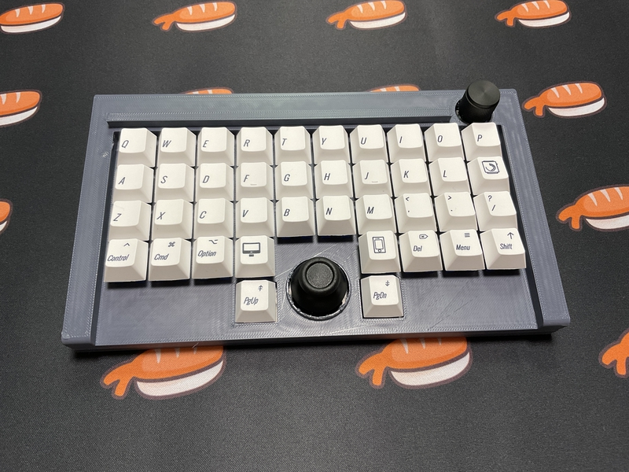

# ckb6

## What is ckb6?

ckb6 is a small keyboard with ortho layout
 
ckb6 has one joystick and one rotally encoder.
 
ckb6 use RP2040-Zero,run qmk_firmware.
 
 

## firmware

[vial](https://get.vial.today/) is possible.
 

## build guide

https://github.com/telzo2000/ckb6/blob/main/buildguide_for_ckb6.md

## parts list

| No. | Patrs | Quantity | remarks | Suppliers | Cost |
|--|--|--|--|--|--|
|番号|名前|数|備考|調達先|参考価格（送料込）| 
|1|PCB|1|Ortho Layout|[elecrow](https://www.elecrow.com) [JLCPCB](https://jlcpcb.com) [ALLPCB](https://www.allpcb.com)|５枚で20〜30ドル| 
|2|RP-2040Zero|1||[Talp Keyboard](https://talpkeyboard.net)|450円|
|3|Swith socket スイッチソケット|38|cherry MX互換|[遊舎工房](https://yushakobo.jp) [Talp Keyboard](https://talpkeyboard.net) [Daily Craft Keyboard](https://shop.dailycraft.jp)等|10個で165円程度|
|4|Switch socket スイッチソケット|2|Kailh choc互換|[遊舎工房](https://yushakobo.jp) [Talp Keyboard](https://talpkeyboard.net) [Daily Craft Keyboard](https://shop.dailycraft.jp)等|10個で165円程度|
|5|Diode ダイオード|41|リードタイプでもSMDでも可|[遊舎工房](https://yushakobo.jp) [Talp Keyboard](https://talpkeyboard.net) [Daily Craft Keyboard](https://shop.dailycraft.jp)等|100個で220円程度から|
|6|Rotaly Encoder ロータリーエンコーダー|1|EC12互換、背の高いもの|[Daily Craft Keyboard](https://shop.dailycraft.jp)等|300円|
|7|Joystick|1|RKJXV122400R|[秋月電子](https://akizukidenshi.com/catalog/g/g115951/)|190円|
|8|TopCase|1|3D Print|||
|9|BottomCase|1|3D Print||

In addition, you will need a USB cable, keycaps, etc.
 
この他に、USBケーブル、キーキャップ等が必要です。
 

